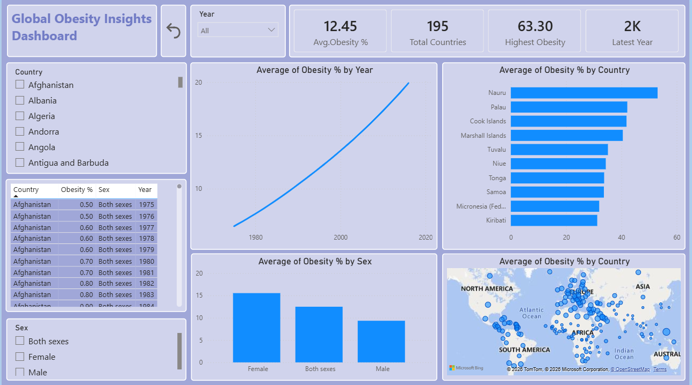

# 🌍 Global Obesity Data Analysis using Python, MySQL & Power BI

## 📌 Project Overview

This project demonstrates an end-to-end data analysis workflow using a global obesity dataset. The project covers importing raw CSV data into Python, cleaning and transforming the data into an analysis-ready format, storing it in a MySQL database, and building an interactive dashboard in Power BI.

---
## Dashboard Preview



# 🛠️ Tools & Technologies

* Python
* Pandas
* NumPy
* MySQL
* SQLAlchemy
* MySQL Connector
* Power BI
* Git & GitHub

---

# 📂 Workflow

```text
Raw CSV
   │
   ▼
Python (Pandas)
   │
   ▼
Data Cleaning
   │
   ▼
Data Transformation
   │
   ▼
MySQL Database
   │
   ▼
Power BI Dashboard
```

---

# 📁 Project Steps

## 1. Import Dataset

* Imported the raw obesity dataset (CSV) into Python using Pandas.
* Loaded the correct header row.
* Explored the dataset using `head()`, `info()`, `shape()`, and `describe()`.

---

## 2. Data Cleaning

Performed data cleaning to improve data quality:

* Removed unnecessary metadata rows.
* Renamed columns.
* Fixed incorrect data types.
* Converted obesity values to numeric.
* Handled missing values.
* Checked for duplicate records.
* Standardized the dataset.

---

## 3. Data Transformation

Restructured the dataset into a tidy format suitable for analysis.

### Original Structure

| Country | 1975 | 1975.1 | 1975.2 | ... |
| ------- | ---- | ------ | ------ | --- |

### Transformed Structure

| Country | Year | Sex    | Obesity% |
| ------- | ---- | ------ | -------- |
| India   | 1975 | Male   | 0.3      |
| India   | 1975 | Female | 0.5      |
| India   | 1975 | Both   | 0.4      |

Transformation tasks included:

* Converted wide-format data into long-format.
* Split **Year** and **Sex** into separate columns.
* Renamed columns for better readability.
* Created an analysis-ready dataset.

---

## 4. Store Data in MySQL

Connected Python to MySQL using SQLAlchemy and MySQL Connector.

* Created a MySQL database.
* Exported the cleaned DataFrame directly to MySQL.
* Verified that the data was successfully imported.

---

## 5. Connect MySQL with Power BI

Connected Power BI directly to the MySQL database.

Benefits:

* Live connection to the cleaned dataset.
* No need to import CSV files again.
* Easy data refresh after database updates.

---

## 6. Power BI Dashboard

Created an interactive dashboard to visualize obesity trends.

### Dashboard Features

* KPI Cards
* Country-wise Obesity Analysis
* Year-wise Trend Analysis
* Male vs Female Comparison
* Interactive Filters (Country, Year, Sex)
* Top Countries by Obesity Percentage

---

# 📊 Skills Demonstrated

* Data Cleaning
* Data Transformation
* Data Reshaping
* ETL Workflow
* Python Automation
* MySQL Database Integration
* SQL
* Power BI Dashboard Development
* Data Visualization

---

# 📚 Python Libraries Used

```text
pandas
numpy
sqlalchemy
mysql-connector-python
```

---

# 🚀 Project Outcome

Successfully built a complete data analysis pipeline:

* Imported raw CSV data into Python.
* Cleaned and transformed the dataset.
* Stored the processed data in a MySQL database.
* Connected MySQL directly to Power BI.
* Built an interactive dashboard for data visualization and analysis.

---


Aspiring Data Analyst | Python | SQL | MySQL | Power BI

> **Note:** The database username, password, and connection details used in this project are **demo credentials** provided for demonstration purposes only. Replace them with your own MySQL credentials before running the project in your local environment.

